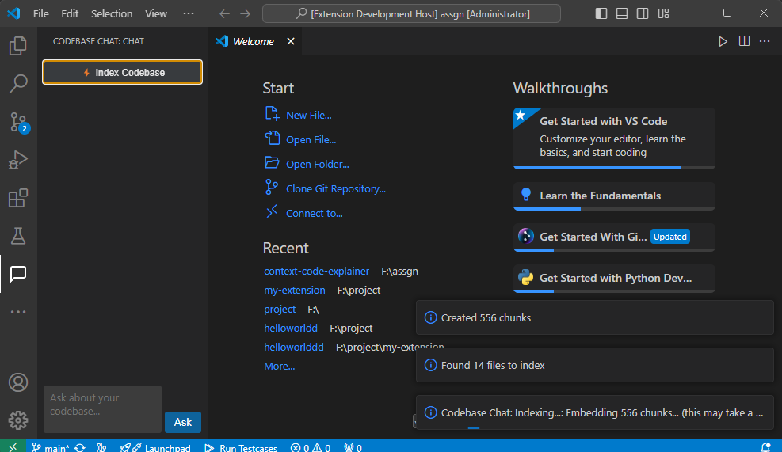

# Codebase Chat — VS Code Extension

> **Chat with your codebase.** Ask questions in plain English, get grounded answers from your actual source files — no hallucinations, no tab-switching.





## What it does & the problem it solves

Honestly, this project came from two things happening at the same time.

First, I was learning RAG — how you chunk documents, embed them into a vector store, and retrieve the relevant bits to ground an LLM's answer. I understood the concept, but I wanted to actually build something with it, not just run a tutorial notebook.

Second, I kept hitting a frustration at work: whenever I landed on an unfamiliar file or wanted to understand how something in the codebase connected to something else, my reflex was to *copy the code and paste it into ChatGPT*. Which works — until the file is too long, or the answer depends on three other files you forgot to include, or the LLM just confidently makes something up because it has no idea what your actual code does.

That's when it clicked. RAG is literally designed for this. You chunk your documents, embed them, and retrieve what's relevant. Your codebase *is* a collection of documents. So — why not do the same thing with source files and build it straight into the editor?

That's **Codebase Chat**. Index your project once, then ask questions in a sidebar panel. The extension finds the most relevant chunks across your actual files and sends them to the LLM as context — so the answer is grounded in *your* code, not a hallucination. It also tells you which files it pulled from.

Here's how it works end-to-end:

```
Your project files
       │
       ▼
  [ Indexer ]  — walks files, chunks them, embeds with Ollama (nomic-embed-text) → saves index to disk as JSON
       │
       ▼
  [ Retriever ] — embeds your question via Ollama, runs cosine similarity search, pulls top-5 relevant chunks
       │
       ▼
  [ Groq LLM ] — receives question + retrieved code context → returns a grounded answer
       │
       ▼
  Sidebar panel in VS Code — with source file citations
```

**Why RAG instead of just dumping all the code into the LLM?**  
Real projects are too large for any context window and spread across dozens of files. RAG retrieves *only the relevant* chunks for each question — so answers are accurate, fast, and always cite which file they came from.

---

## How to install and run from source

### Prerequisites

- Node.js ≥ 18
- VS Code ≥ 1.70
- **[Ollama](https://ollama.com)** installed and running locally (for embeddings — free, no API key needed)
- A Groq API key (for LLM responses — [get one free at console.groq.com](https://console.groq.com))

### 1. Clone the repo

```bash
git clone https://github.com/<your-username>/codebase-chat.git
cd codebase-chat
```

### 2. Install dependencies

```bash
npm install
```

### 3. Start Ollama and pull the embedding model

```bash
# Start the Ollama server (keep this running in the background)
ollama serve

# In a separate terminal, pull the embedding model
ollama pull nomic-embed-text
```

> **Note:** Ollama must be running at `http://localhost:11434` whenever you index or query. If you see a `fetch failed` error, this is why.

### 4. Set your Groq API key

Open VS Code Settings (`Ctrl+,`), search for **Codebase Chat**, and paste your Groq API key into `codebaseChat.groqApiKey`.

> You no longer need an OpenAI API key — embeddings are handled locally by Ollama for free.

### 5. Compile

```bash
npm run compile
```

### 6. Launch the extension

Press **F5** in VS Code. A new Extension Development Host window opens.

### 7. Use it

1. Open any project folder in the Extension Development Host window
2. Click the **Codebase Chat** icon in the Activity Bar (left sidebar)
3. Click **⚡ Index Codebase** — this walks your files, chunks them, and embeds them via Ollama. Progress is shown in the notification area. The index is saved to VS Code's global storage as `codebase-index.json`.
4. Type any question and hit **Ask** (or `Ctrl+Enter`)

> **Where is the index stored?**  
> `C:\Users\<you>\AppData\Roaming\Code\User\globalStorage\<extension-id>\codebase-index.json`  
> You can open this file to inspect the chunks and their embedding vectors.

---

## Architecture & folder structure

```
src/
├── extension.ts   — activation entry point, sidebar webview registration
├── indexer.ts     — file walker, text splitter, Ollama embeddings, JSON index save
└── retriever.ts   — cosine similarity search, Groq LLM call, returns answer + source citations

media/
└── icon.svg       — activity bar icon
```

**Key tech choices:**

| Concern | Choice | Reason |
|---|---|---|
| Embeddings | Ollama (`nomic-embed-text`) | Runs fully locally — free, no API key, no usage limits |
| Vector search | Pure-JS cosine similarity over JSON | No native C++ deps — works in any VS Code extension out of the box |
| LLM | Groq (`llama-3.1-8b-instant`) | Free tier, extremely fast inference |
| Chunking | `RecursiveCharacterTextSplitter` (500 tokens, 50 overlap) | Respects code structure |

---

## The hardest problems I ran into — and how I solved them

### Problem 1: Initializing a VS Code extension is not obvious

Before any of the RAG logic, I just needed the extension to *load*. Turns out the VS Code extension manifest (`package.json`) is very particular, and I managed to break it in a way that took me a while to understand.

I wanted to load API keys from a `.env` file, and my first instinct was to reference them directly in `package.json` as configuration defaults:

```json
"default": `${process.env.OPEN_AI_API_KEY}`
```

This is completely invalid — `package.json` is **static JSON**, not JavaScript. Template literals don't exist in JSON. VS Code couldn't parse the manifest at all, so the extension silently failed to activate with no useful error message. I spent a good chunk of time confused about why nothing was loading before I realized the manifest itself was broken.

Once I understood that `package.json` in a VS Code extension is a declarative config file (not a Node.js module), things started making more sense. The fix was to set `"default": ""` and handle key loading entirely in TypeScript at runtime.

### Problem 2: API keys from `.env` weren't reaching the indexer at runtime

After fixing the manifest, I had a subtler bug: the keys from `.env` still weren't being picked up when the user clicked "Index Codebase".

I tried writing them into VS Code settings via `config.update()` inside `activate()`. That also failed silently: `config.update()` is **async** and returns a Promise I wasn't awaiting. By the time the user clicked the button, the write hadn't finished and `config.get()` still returned `""`.

**How I solved it:**

1. Used `dotenv.config({ path: envPath })` — which is **synchronous** — at the very start of `activate()`, before registering anything. This immediately populates `process.env`.
2. In `retriever.ts`, only the Groq key is now required. Embeddings are handled by Ollama locally with no key needed at all.

The core lesson: **don't mix async config writes with synchronous reads in the activation flow** — if you need something available immediately, `process.env` is your friend.

### Problem 3: Switching from OpenAI embeddings to Ollama

The original version used OpenAI's `text-embedding-ada-002` for embeddings, which costs money per token. To make this completely free, I switched to [Ollama](https://ollama.com) running `nomic-embed-text` locally.

The change was straightforward in LangChain — swap `OpenAIEmbeddings` for `OllamaEmbeddings` — but it also uncovered a silent bug: the old API key guard (`if (!openaiKey || !groqKey)`) was still in `retriever.ts` after the switch. Since `openaiKey` is now always empty, **every query was silently returning "Missing API keys"** before even touching the index. Removing that dead check unblocked everything.

### Problem 4: HNSWLib requires native C++ build tools

The original version used HNSWLib as the vector store via `@langchain/community`. This worked fine in a Node.js script but failed inside a VS Code extension because `hnswlib-node` is a **native C++ addon** that needs to be compiled at install time — requiring Python and Visual C++ Build Tools (MSVC).

Rather than requiring every user to install build tools, the vector store was replaced with a **pure-JS implementation**: the index is saved as a plain `codebase-index.json` file (each chunk's text + its embedding vector), and similarity search is done with a simple cosine similarity function at query time. This has zero native dependencies and works anywhere Node.js runs.

> If you prefer HNSWLib, install Windows Build Tools with:
> ```
> npm install --global windows-build-tools  # run as Administrator
> npm install hnswlib-node --legacy-peer-deps
> ```

---

## LLM conversation — how I used AI as a thinking tool

I used Claude to work through the RAG architecture before writing any code. Here's a condensed version of that conversation:

**Me:**  
> I want to build a VS Code extension where you can chat with your codebase. I'm thinking embeddings + vector store + LLM. What should the architecture look like and what should I cut to ship in 48 hours?

**Claude:**
> Core loop: index (chunk → embed → store) + query (embed question → similarity search → LLM with context). For 48h, cut: auth, multi-workspace, streaming responses, chunk deduplication, re-indexing diffs. Use HNSWLib — no server to spin up. Groq for LLM — free and fast. Two commands: index + query. One sidebar webview. That's it.

**Me:**
> Why RAG vs just dumping all files into the context?

**Claude:**
> Token limits. A real project has hundreds of thousands of tokens. You can't fit it. RAG retrieves only what's relevant for the question — 5 chunks instead of 500 files. Also cheaper and faster.

**Me:**
> What chunk size should I use for code?

**Claude:**
> 500 tokens with 50 overlap. Small enough that each chunk is one logical unit (a function, a block). Overlap prevents a function split across chunks from losing context. `RecursiveCharacterTextSplitter` respects newlines and brackets — use that over a naive splitter.

This saved me a lot of trial and error on architecture decisions. The most valuable thing was getting the clarity to **cut scope aggressively** — no streaming, no Chroma server, no diff-based re-indexing — and just ship the core RAG loop working end-to-end.

---

## What I'd do next with more time

1. **Better chunking and retrieval strategies** — I used a fixed 500-token split with 50 overlap, which works but is pretty naive. I'd want to research AST-based chunking (splitting by function/class boundaries instead of character count) and experiment with reranking retrieved chunks before passing them to the LLM. This is probably the highest-leverage improvement for answer quality.

2. **Incremental re-indexing** — right now the whole project re-indexes on every click. A file-watcher + hash-based dirty tracking would only re-embed changed files.

3. **Streaming responses** — Groq supports it; piping chunks back to the webview via `postMessage` would make it feel a lot more responsive.

4. **Conversation history** — every question is currently independent. Passing the last few turns as context would enable natural follow-ups like "what about the error handling in that function?".

5. **Publish to VS Code marketplace** — package as `.vsix` and submit. Would need to handle API key setup UX more gracefully (prompt on first use instead of relying on `.env`).

---

## Tech stack

- **Language:** TypeScript
- **VS Code API:** Webview panels, commands, workspace configuration
- **LangChain.js:** `@langchain/ollama`, `@langchain/community`, `@langchain/textsplitters`, `@langchain/core`
- **Embeddings:** Ollama (`nomic-embed-text`) — local, free, no API key
- **Vector search:** Pure-JS cosine similarity over a JSON index
- **LLM:** Groq (`llama-3.1-8b-instant`)
